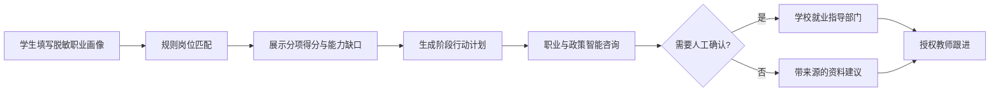

# 职途智航成果应用案例方案

> 项目名称：职途智航 - 成都信息工程大学就业择业规划智能体  
> 参赛方向：校园管理方向  
> 适用单位：成都信息工程大学就业指导与学生发展场景  
> 版本：v1.0  
> 日期：2026-07-23

## 一、应用背景与痛点

高校毕业生在求职准备阶段，常面临岗位信息分散、职业目标模糊、能力差距难量化、就业政策难检索等问题。就业指导教师需要为不同专业、不同求职阶段的学生提供建议，但人工咨询时间有限，且建议过程难以持续追踪。

现有通用问答工具无法保证岗位来源、推荐依据和隐私边界。学生若直接提交完整简历或联系方式，也会增加数据泄露风险。因此，本项目聚焦“在不收集非必要个人信息的前提下，为学生提供可解释岗位匹配、可执行行动计划和可信资料咨询”的实际需求。

## 二、解决方案

职途智航是面向成都信息工程大学学生的就业择业规划智能体。系统以学生主动填写的脱敏职业画像为输入，结合已审核的岗位与就业资料，形成“画像 - 匹配 - 差距 - 计划 - 咨询 - 教师协助”的闭环。

### 2.1 核心功能

| 功能 | 用户价值 | 实现方式 |
|:---|:---|:---|
| 职业画像 | 帮助学生梳理专业、技能、项目、目标岗位和城市 | 受控表单与字段校验，只保存规划所需信息 |
| 岗位推荐 | 让学生理解岗位为何被推荐 | 固定规则计算 0-100 分并展示分项、缺口和来源 |
| 行动计划 | 将能力差距转为阶段性任务 | 基于匹配缺口生成可执行待办，不承诺录用结果 |
| 智能咨询 | 查询职业准备与就业政策资料 | SF-FastGPT 工作流检索；无可靠来源时建议人工确认 |
| 教师协助 | 支持教师在授权范围内跟进学生 | 只展示职业摘要、计划状态和教师本人意见 |
| 管理员工作台 | 管理岗位、资料与授权边界 | 展示审核追溯信息和脱敏审计，不展示密钥或完整画像 |

### 2.2 业务闭环

## 三、创新点与可推广性

1. **可解释而非黑箱推荐。** 岗位匹配固定采用技能 50 分、专业 20 分、项目 15 分、城市 5 分、目标岗位 10 分的规则权重；学生可看到每项得分、能力缺口和信息来源。
2. **知识检索与业务数据分离。** PostgreSQL 保存最小化业务数据，SF-FastGPT 仅负责受审核资料的检索与工作流，平台不直接访问数据库。
3. **安全优先的人工兜底。** 平台异常、资料缺失或回答没有可引用来源时，系统统一给出人工确认建议，不伪造政策、岗位或录用结论。
4. **三角色协同。** 学生、就业指导教师和管理员具有不同数据可见范围，适合就业指导部门的实际协作过程。
5. **可复制落地。** 岗位台账、资料登记模板、审核流程和工作流变量均可替换，后续可扩展到其他学院或生涯教育场景。

## 四、数据与知识来源

| 数据类别 | 当前来源 | 使用边界 |
|:---|:---|:---|
| 岗位数据 | 项目组构造的模拟岗位台账 | 仅用于本地功能验证与演示，不表述为真实招聘信息 |
| 就业政策与职业发展资料 | `docs/knowledge-base/source-registry.csv` 登记后审核 | 需具备来源、日期、适用范围和审核状态后才可上传知识库 |
| 学生职业画像 | 学生主动输入的脱敏信息 | 不采集联系方式、学号、性别、籍贯、健康、政治面貌、家庭情况或完整成绩单 |
| 教师意见与审计 | 系统受控写入 | 仅限授权范围；审计不保存请求体、画像、令牌或密钥 |

## 五、预期应用效果与评价指标

| 目标 | 可观察指标 | 验证方式 |
|:---|:---|:---|
| 提升学生规划清晰度 | 学生完成画像、查看缺口并生成计划 | 学生端完整闭环演示 |
| 提升建议可解释性 | 每个推荐展示总分、分项、缺口和来源 | 匹配结果页面与接口验证 |
| 降低教师重复答疑负担 | 教师只查看授权学生摘要并提交定向意见 | 教师工作台演示 |
| 保证资料可追溯 | 岗位与知识资料具有来源、日期、状态和适用范围 | 管理员资料台账演示 |
| 控制隐私风险 | 敏感字段、密钥和连接串不出现在前端、日志或演示画面 | 自动化隐私检查与脱敏审计 |

首版仅使用模拟数据，未对真实学生就业结果作出统计结论。正式试点前，应由学校就业指导部门审核知识资料、岗位来源、数据授权和使用流程。

## 六、实施范围与后续计划

首版已实现本地 PostgreSQL 数据持久化、三角色权限控制、确定性匹配、行动计划、模拟咨询模式、教师意见、管理员资料与审计工作台。下一步将在赛事平台提供基础地址、服务端 API Key 和两个工作流 ID 后，完成 SF-FastGPT 真实知识库联调；随后由学校审核可引用资料并开展小范围试用。

不在首版范围内的事项包括：接入学校生产数据库、接入真实学生账号、自动同步招聘平台、对就业结果作出预测或承诺。
