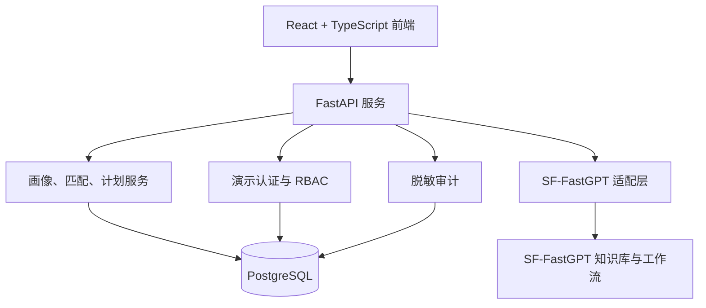

# 职途智航成果实施技术文档

> 项目名称：职途智航 - 成都信息工程大学就业择业规划智能体  
> 版本：v1.0  
> 日期：2026-07-23

## 一、技术目标

项目实现一个可本地部署、可演示、可审计的高校就业择业规划智能体。系统必须支持学生职业规划闭环、教师授权协助和管理员资料治理，同时避免将数据库凭据、平台密钥或非必要学生信息暴露给浏览器与模型平台。

## 二、总体架构



| 层级 | 采用技术 | 职责 |
|:---|:---|:---|
| 前端 | React、TypeScript、Vite | 学生、教师、管理员工作台与响应式界面 |
| 后端 | FastAPI、Pydantic | 接口、输入校验、权限控制和安全响应 |
| 数据访问 | SQLAlchemy 2、Alembic、psycopg | PostgreSQL 模型、迁移、事务和索引 |
| 智能体适配 | SF-FastGPT Chat Completions 适配器 | 工作流路由、资料来源归一化和安全降级 |
| 数据治理 | CSV 台账与 Markdown 规范 | 模拟岗位、资料来源、审核状态和使用边界 |

## 三、关键实现

### 3.1 三角色权限

学生只能读写自己的职业画像、匹配结果和行动计划。教师需要管理员的显式授权才能查看某位学生的职业摘要、计划状态和本人意见。管理员可维护授权，查看岗位和资料审核字段以及脱敏审计，但不能读取完整画像、意见正文、数据库连接串或 FastGPT 密钥。

演示登录使用服务端内存会话，不保存密码；令牌重启后失效，最长有效期为 8 小时。所有越权访问都记录为仅含角色、操作、资源类型、资源标识和时间的脱敏审计事件。

### 3.2 可解释岗位匹配

岗位匹配为不依赖大模型的确定性服务，只从已发布、未过期且有来源标题的岗位中选择。总分为 100 分：技能 50 分、专业 20 分、项目 15 分、目标城市 5 分、目标岗位 10 分。服务返回分项得分、未满足技能、岗位来源与稳定排序，同一输入始终获得同一结果。

### 3.3 SF-FastGPT 工作流

后端为职业咨询与政策咨询定义统一的 `AssistantResponse` 契约，包含回答、来源、免责声明、人工兜底标记和运行模式。职业与政策工作流分别映射到服务端环境变量中的工作流 ID，前端不保存平台地址、密钥或工作流 ID。

当 `FASTGPT_MODE=mock` 时，系统返回统一的本地人工确认建议。当切换为 `sf_fastgpt` 时，服务端向可配置的 Chat Completions 路径发送最小化问题与上下文。平台请求失败、格式异常或没有可信来源时，系统不返回原始错误，而是转为人工确认。

### 3.4 数据与隐私边界

- PostgreSQL 只保存职业规划所需的脱敏字段和合成演示身份。
- 不保存或推断电话、邮箱、学号、性别、籍贯、健康状况、政治面貌、家庭情况和完整成绩单。
- 岗位资料与知识资料必须具备来源、日期、状态和适用范围；无来源资料不能进入推荐。
- 数据库 URL、FastGPT API Key、工作流 ID 仅位于 `.env` 或部署环境，禁止写入前端、日志、录屏和提交材料。
- 当前岗位为模拟数据，不得作为真实招聘承诺或上传为真实招聘知识。

## 四、部署与运行

### 4.1 前置条件

- Windows 环境，Node.js 与 npm。
- PostgreSQL 14+，本地数据库已启动。
- Python 虚拟环境位于 `backend/.venv`。
- 根目录 `.env` 已配置 `DATABASE_URL`；真实联调还需配置 SF-FastGPT 服务端参数。

### 4.2 启动步骤

```powershell
# 1. 应用数据库迁移
$env:PYTHONPATH = (Join-Path (Get-Location) 'backend')
& backend\.venv\Scripts\alembic.exe -c backend\alembic.ini upgrade head

# 2. 启动后端
& backend\.venv\Scripts\uvicorn.exe app.main:app --app-dir backend --reload --port 8000

# 3. 在新的终端启动前端
Set-Location frontend
npm run dev -- --port 5174
```

前端访问地址为 `http://127.0.0.1:5174`，后端接口地址为 `http://127.0.0.1:8000`。

### 4.3 SF-FastGPT 配置与验收

在根目录 `.env` 配置以下服务端变量，实际值不得提交到版本库或出现在录屏中：

```env
FASTGPT_MODE=sf_fastgpt
FASTGPT_BASE_URL=https://<platform-host>
FASTGPT_API_KEY_CAREER=<career-server-side-key>
FASTGPT_API_KEY_POLICY=<policy-server-side-key>
FASTGPT_CHAT_COMPLETIONS_PATH=/api/v1/chat/completions
FASTGPT_WORKFLOW_CAREER_ID=<career-workflow-id>
FASTGPT_WORKFLOW_POLICY_ID=<policy-workflow-id>
```

配置完成后执行：

```powershell
$env:PYTHONPATH = (Join-Path (Get-Location) 'backend')
& backend\.venv\Scripts\python.exe -m scripts.verify_fastgpt
```

该脚本分别调用职业与政策工作流，仅输出运行模式、来源数量、来源完整性和通过状态。两条工作流均应返回带标题、链接、版本或日期的资料来源，且不得触发人工兜底。

## 五、测试与验证

| 验证项 | 当前结果 |
|:---|:---|
| 后端单元测试 | 26 项通过，覆盖配置、模型、RBAC、匹配、FastGPT 适配、隐私、教师意见与联调诊断 |
| 后端静态检查 | Ruff 检查和格式校验通过 |
| 前端质量检查 | ESLint 通过，TypeScript 与 Vite 生产构建成功 |
| 数据库迁移 | 当前版本为 `20260723_0003 (head)` |
| 页面验证 | 学生、教师、管理员关键路径已在本地演示；学生与教师移动端 375px 无水平溢出 |
| SF-FastGPT 真实联调 | 待赛事平台提供并配置 API Key 与两个工作流 ID 后执行 |

完整验收记录见 `docs/testing/t010-validation.md`。

## 六、运维与扩展建议

正式试点前应由就业指导部门审核资料来源、更新周期和适用范围，并建立资料失效机制。后续可增加学院维度的资料隔离、更多行动计划模板、人工咨询预约及审批流。任何生产数据库、真实学生身份认证或外部招聘数据同步接入，都应重新进行数据授权与安全评审。
