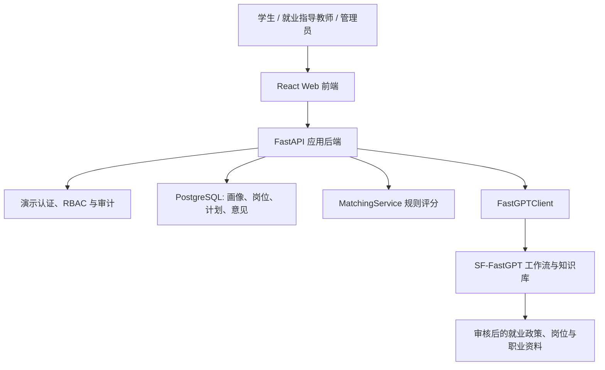
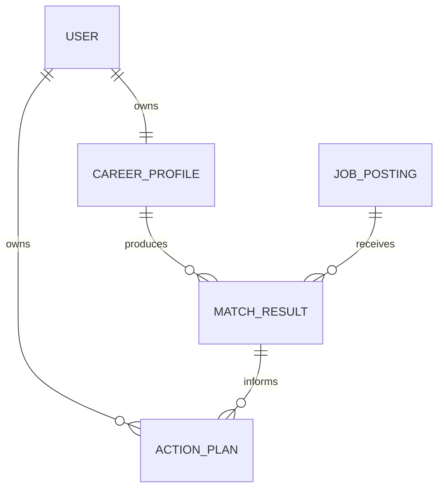

# 架构设计 (Architecture Specification)

> **功能名称：** 职途智航 - 高校就业择业规划智能体
> **版本：** v1.0
> **状态：** 已由 `docs/specs/design.md` 与 `docs/specs/requirements.md` 补充修订
> **关联需求：** `docs/specs/product.md`
> **最后更新：** 2026-07-21

## 1. 系统概览

职途智航采用 React 网页前端、FastAPI 后端、PostgreSQL 演示数据库和 SF-FastGPT 四层结构。浏览器只访问本系统后端；后端负责演示身份、角色权限、画像、岗位、匹配规则、行动计划和审计；SF-FastGPT 负责检索经审核的就业政策、岗位说明和职业发展资料，并编排咨询和计划生成工作流。

岗位推荐由 `MatchingService` 使用固定权重计算，保证结果可复现、可解释。FastGPT 只能根据后端提供的分数、缺口和受控资料生成自然语言建议，不能覆盖分数、虚构岗位或作出就业决定。

### 架构决策记录 (ADR)

| 决策 | 选择方案 | 被否定方案 | 理由 |
|:---|:---|:---|:---|
| 匹配逻辑 | 后端确定性评分 + FastGPT 解释 | 仅大模型主观推荐 | 结果可测试、可解释、可审计 |
| 数据环境 | PostgreSQL + 脱敏样本 + 模拟岗位库 | SQLite / 直连真实就业系统 | 支持迁移和后续多用户部署，同时保持授权边界 |
| 平台接入 | 后端适配 SF-FastGPT API | 浏览器直连平台 | 防止密钥泄露，统一权限和日志 |
| 岗位资料 | 资料台账审核后发布 | 无来源网页文本直接入库 | 避免过期、虚假或不合规岗位信息 |
| 人工兜底 | 教师意见和协助请求 | Agent 自动决定 | 保留高校就业指导专业判断 |

## 2. 组件拓扑图



## 3. 数据模型

### 3.1 实体定义

#### User

| 字段名 | 类型 | 约束 | 描述 |
|:---|:---|:---|:---|
| `id` | UUID | PK | 演示用户标识 |
| `display_name` | VARCHAR(100) | NOT NULL | 脱敏显示名 |
| `role` | ENUM | NOT NULL | `student`、`counselor`、`admin` |

#### CareerProfile

| 字段名 | 类型 | 约束 | 描述 |
|:---|:---|:---|:---|
| `id` | UUID | PK | 画像标识 |
| `student_id` | UUID | FK -> User.id | 所属学生 |
| `major` | VARCHAR(100) | NOT NULL | 专业 |
| `skills` | JSON | NOT NULL | 技能标签 |
| `projects` | JSON | NOT NULL | 脱敏项目摘要 |
| `target_roles` | JSON | NOT NULL | 目标岗位 |
| `target_cities` | JSON | NOT NULL | 目标城市 |
| `job_stage` | ENUM | NOT NULL | `exploring`、`preparing`、`applying` |

#### JobPosting

| 字段名 | 类型 | 约束 | 描述 |
|:---|:---|:---|:---|
| `id` | UUID | PK | 岗位标识 |
| `title` | VARCHAR(200) | NOT NULL | 岗位名称 |
| `company_name` | VARCHAR(200) | NOT NULL | 演示企业名称或来源名称 |
| `city` | VARCHAR(100) | NOT NULL | 工作城市 |
| `required_skills` | JSON | NOT NULL | 技能要求 |
| `source_title` | VARCHAR(255) | NOT NULL | 来源标题 |
| `source_url` | VARCHAR(500) | NULL | 来源链接 |
| `published_on` | DATE | NOT NULL | 发布日期 |
| `status` | ENUM | NOT NULL | `draft`、`published`、`expired` |

#### MatchResult

| 字段名 | 类型 | 约束 | 描述 |
|:---|:---|:---|:---|
| `id` | UUID | PK | 匹配结果标识 |
| `profile_id` | UUID | FK -> CareerProfile.id | 输入画像 |
| `job_id` | UUID | FK -> JobPosting.id | 推荐岗位 |
| `score` | INTEGER | 0-100 | 规则匹配分 |
| `score_breakdown` | JSON | NOT NULL | 技能、专业、项目、城市、偏好分项 |
| `gaps` | JSON | NOT NULL | 需补强能力 |

#### ActionPlan

| 字段名 | 类型 | 约束 | 描述 |
|:---|:---|:---|:---|
| `id` | UUID | PK | 计划标识 |
| `student_id` | UUID | FK -> User.id | 所属学生 |
| `match_id` | UUID | FK -> MatchResult.id | 目标匹配结果 |
| `items` | JSON | NOT NULL | 分阶段待办 |
| `status` | ENUM | NOT NULL | `active`、`completed` |

### 3.2 实体关系图



## 4. API / 接口签名

### 4.1 创建或更新职业画像

| 属性 | 值 |
|:---|:---|
| **方法** | `PUT` |
| **路径** | `/api/v1/career-profile/me` |
| **认证** | 必需 |
| **权限** | `student` |

```json
{
  "major": "软件工程",
  "skills": ["Python", "SQL"],
  "projects": ["脱敏项目摘要"],
  "target_roles": ["后端开发"],
  "target_cities": ["成都"],
  "job_stage": "preparing"
}
```

### 4.2 获取岗位匹配结果

| 属性 | 值 |
|:---|:---|
| **方法** | `POST` |
| **路径** | `/api/v1/matches` |
| **认证** | 必需 |
| **权限** | `student` |

```json
{
  "limit": 5
}
```

成功响应包含岗位、规则分、分项说明、能力缺口和来源；没有可信岗位时返回空列表和人工咨询建议。

### 4.3 生成求职行动计划

| 属性 | 值 |
|:---|:---|
| **方法** | `POST` |
| **路径** | `/api/v1/action-plans` |
| **认证** | 必需 |
| **权限** | `student` |

```json
{
  "match_id": "uuid"
}
```

### 4.4 就业咨询与 FastGPT 工作流

| 属性 | 值 |
|:---|:---|
| **方法** | `POST` |
| **路径** | `/api/v1/assistant/query` |
| **认证** | 必需 |
| **权限** | `student`、`counselor`、`admin` |

请求包括问题、咨询类型和最小化画像/岗位上下文；响应包括回答、资料来源、免责声明和转人工建议。浏览器不接收 FastGPT 密钥。

## 5. 依赖白名单

| 依赖名 | 版本 | 用途 | 是否新增 |
|:---|:---|:---|:---|
| React | 18.x | 网页前端 | 是 |
| TypeScript | 5.x | 前端类型安全 | 是 |
| Vite | 5.x 或兼容版 | 前端构建 | 是 |
| FastAPI | 0.115+ 或兼容版 | 后端 API | 是 |
| SQLAlchemy | 2.x | PostgreSQL ORM 和会话管理 | 是 |
| Alembic | 1.x | PostgreSQL schema 迁移 | 是 |
| psycopg | 3.x | PostgreSQL 驱动 | 是 |
| httpx | 0.27+ | 服务端调用 SF-FastGPT | 是 |

## 6. 错误处理策略

| 错误场景 | 处理方式 | 用户感知 |
|:---|:---|:---|
| 画像不完整 | 返回缺失字段 | “请补充目标岗位、技能或城市后再匹配” |
| 无可信岗位 | 返回空结果和教师咨询建议 | “当前没有可推荐的有效岗位” |
| FastGPT 超时或无依据 | 保留规则结果，转人工 | “智能咨询暂不可用，请联系就业指导教师” |
| 岗位过期 | 不参与评分 | “该岗位信息已失效” |
| 越权访问 | 返回 403 并审计 | “你无权查看该信息” |

## 7. 安全策略

- **输入验证：** 校验角色、枚举、文本长度和技能标签；拒绝将未清洗外部文本直接拼入提示词。
- **身份认证：** 首版仅使用隔离演示账号；生产环境接入学校批准的认证服务。
- **数据访问控制：** 学生仅访问本人画像与计划，教师仅访问授权学生，管理员仅维护资料和查看脱敏审计。
- **敏感数据处理：** 不收集或推断性别、籍贯、家庭情况、健康状况、民族、政治面貌、联系方式或完整成绩单。
- **审计日志：** 记录角色、操作类型、资源标识和时间；不记录完整画像、简历内容或 API Key。

## 8. 性能考量

| 指标 | 目标值 | 测量方式 |
|:---|:---|:---|
| 本地画像/匹配 API P95 | 小于 1 秒 | 自动化测试与访问日志 |
| 匹配结果数量 | 3-5 条 | 集成测试 |
| FastGPT 咨询 P95 | 小于 15 秒 | 联调记录 |
| 演示并发会话 | 20 个活跃会话 | 手工并发验证 |

## 9. 审批记录

| 日期 | 审批人 | 决定 | 备注 |
|:---|:---|:---|:---|
| 2026-07-21 | 项目负责人 | 批准 | 已批准进入实施 |
