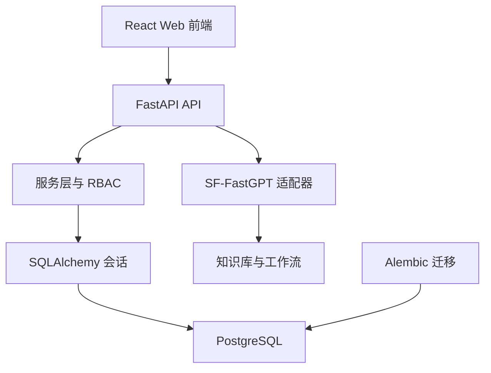

# 技术设计规范 (Design-First Specification)

> **设计名称：** 职途智航 PostgreSQL 持久化设计
> **设计粒度：** High Level Design
> **版本：** v1.0
> **状态：** 已批准
> **最后更新：** 2026-07-21

## 1. 设计概述

职途智航首版直接使用 PostgreSQL 作为唯一业务数据库，不再提供 SQLite 回退。PostgreSQL 负责保存脱敏演示用户、职业画像、岗位、匹配结果、行动计划、教师意见和审计事件；SF-FastGPT 仍只负责知识检索和工作流，不直接连接数据库。

该设计先于代码实施，因为数据库类型决定 ORM、迁移工具、字段类型、部署环境和密钥管理方式。首版保持本地 PostgreSQL 实例与模拟数据，不接入学校生产数据库。

## 2. 设计起点与约束

### 2.1 已知输入

- 已批准的产品范围、数据治理和岗位台账位于 `product.md` 与 `docs/data-governance/`。
- 用户要求直接使用 PostgreSQL。
- 后端为 FastAPI，之后将通过 SQLAlchemy 2 和 Alembic 管理模型与迁移。

### 2.2 强约束

- `DATABASE_URL` 必须通过 `.env` 或部署环境变量提供，格式为 `postgresql+psycopg://用户名:密码@主机:端口/数据库名`。
- 连接串、密码、真实学生资料和生产数据库地址不得提交到仓库、日志、截图或 FastGPT 提示词。
- 首版只允许使用本地 PostgreSQL 与脱敏演示数据；任何生产库接入须重新审批。
- 数据库模型不创建或推断性别、籍贯、家庭情况、健康状况、民族、政治面貌、联系方式和完整成绩单字段。

### 2.3 假设

- 本地已安装或将安装可访问的 PostgreSQL 14+ 实例；实际主机、端口、用户和密码由项目负责人在 `.env` 配置。
- 开发数据库暂定名称为 `career_navigator`，但不写入源码中的硬编码连接串。
- 演示环境连接池较小，默认不超过 5 个持久连接。

## 3. 目标系统边界

| 组件 / 模块 | 作用 | 是否变更 |
|:---|:---|:---|
| FastAPI 配置层 | 读取并校验 `DATABASE_URL` | 是 |
| SQLAlchemy 2 | 定义 ORM 模型和数据库会话 | 是 |
| Alembic | 创建、升级和验证数据库迁移 | 是 |
| PostgreSQL | 业务持久化与事务一致性 | 是 |
| SF-FastGPT | 检索和工作流，不持有数据库凭据 | 否 |
| 学校生产数据库 | 不在首版连接范围 | 否 |

## 4. 方案设计

### 4.1 总体方案

后端启动时加载环境配置，不在导入阶段建立数据库连接。请求处理层通过受控数据库会话调用服务层；服务层以事务保存画像、岗位、匹配、计划和审计。Alembic 负责从空数据库按版本创建 schema，所有结构变更必须先产生迁移再部署。

使用 PostgreSQL 原生 `UUID` 作为主键、`JSONB` 保存技能标签、项目摘要、评分分项和计划项，使用受控 `ENUM` 或受限字符串表示角色、岗位状态和求职阶段。对 `student_id`、`profile_id`、`job_id`、状态和发布时间建立必要索引。

### 4.2 拓扑 / 调用链

### 4.3 关键接口与数据流

| 接口 / 数据流 | 输入 | 输出 | 约束 |
|:---|:---|:---|:---|
| 配置加载 | `DATABASE_URL` | 受控设置对象 | 缺失、非 PostgreSQL 协议或空密码时在启动前报错，不输出连接串 |
| 迁移升级 | Alembic revision | PostgreSQL schema | 仅从已版本化迁移执行，不允许运行时建表 |
| API 请求 | 经认证角色和业务输入 | 事务化读写 | 每次请求使用独立会话，服务端校验资源归属 |
| 审计写入 | 操作类型和资源标识 | 脱敏事件 | 禁止保存完整画像和连接串 |

### 4.4 数据模型 / 状态变化

| 对象 | PostgreSQL 表示 | 说明 |
|:---|:---|:---|
| 用户与业务实体主键 | `UUID` | 不使用可推断身份的学号 |
| 技能、项目、目标岗位和计划项 | `JSONB` | 只保存已批准的脱敏字段 |
| 岗位、计划和审计时间 | `TIMESTAMPTZ` | 使用统一 UTC 时间 |
| 角色、求职阶段和岗位状态 | PostgreSQL `ENUM` | 由迁移显式管理 |
| 教师授权关系 | `counselor_student_access` | 仅保存教师 UUID、学生 UUID 与授权时间，用于服务端资源范围校验 |

### 4.5 演示身份与资源授权

- 首版不保存密码、不接入学校统一身份认证。`POST /api/v1/demo/sessions` 只为合成演示账号创建服务端内存会话，令牌在服务重启或 8 小时后失效。
- 每个请求从 `Authorization: Bearer <token>` 解析角色与用户 UUID；浏览器不能自行提交角色覆盖服务端身份。
- 学生只能读取或写入 `student_id` 与当前会话 UUID 相同的资源。教师读取学生画像前，必须存在 `counselor_student_access` 授权记录。管理员维护授权与查看脱敏审计，但不读取学生完整画像。
- 拒绝访问时只写入操作类型、角色、资源类型和资源 UUID；审计元数据固定为空对象，不保存请求体、画像、令牌或连接串。

### 4.6 确定性岗位匹配

- `MatchingService` 只读取状态为 `published` 且 `valid_until` 不早于计算日期的模拟岗位，不调用模型，不写入数据库。
- 单条岗位总分固定为 100 分：技能重合度 50 分、专业匹配 20 分、项目成果信号 15 分、目标城市 5 分、目标岗位 10 分。每一项按规则独立计算并写入 `score_breakdown`。
- 技能使用大小写和首尾空白标准化后的精确标签重合率；专业和城市使用标准化后的精确匹配；项目和目标岗位使用受控信号的包含匹配。专业要求为“不限”时，专业项满分。
- 缺口是岗位必需技能中未与画像技能重合的标签。结果按总分降序、有效期升序、岗位标题升序稳定排序，供后续 API 截取前 3 至 5 条。
- 每项结果附带岗位标题、模拟单位、来源标题、来源链接、发布日期和有效期；来源缺失的岗位不进入匹配结果。

### 4.7 SF-FastGPT 适配与安全降级

- 后端定义统一的 `AssistantResponse`：回答文本、归一化来源列表、免责声明、是否建议转人工与运行模式。模拟客户端和 SF-FastGPT 客户端必须返回此结构；浏览器不接收平台密钥、工作流 ID 或原始响应。
- 工作流路由固定为 `career` 和 `policy`。两者分别读取 `FASTGPT_WORKFLOW_CAREER_ID`、`FASTGPT_WORKFLOW_POLICY_ID`；为兼容既有环境变量名，代码仍沿用该名称，但其语义是 SANGFOR Agent Builder 的应用 ID，并由服务端写入请求体 `appId`。`chatId` 仅用于本次对话会话标识，由服务端生成，绝不复用应用 ID。
- SF-FastGPT 默认调用 `${FASTGPT_BASE_URL}/api/v1/chat/completions`。对于平台 API 根地址为 `https://<platform-host>/api` 的部署，`FASTGPT_BASE_URL` 必须保持为 `https://<platform-host>`，以避免组成重复的 `/api/api` 路径；若赛事平台路径不同，只允许通过 `FASTGPT_CHAT_COMPLETIONS_PATH` 调整，不在前端拼接 URL。真实模式必须同时具备基础地址、职业与政策应用的有效 API Key、两个应用 ID，否则启动拒绝。优先读取 `FASTGPT_API_KEY_CAREER` 和 `FASTGPT_API_KEY_POLICY`；旧的 `FASTGPT_API_KEY` 仅作为两者未单独配置时的兼容回退。
- 客户端仅发送问题与调用方明确提供的最小上下文。HTTP 异常、响应格式异常和缺少可引用来源统一返回安全降级结果，不输出平台响应体、请求头或密钥。
- 来源仅归一化展示标题、链接、版本/日期。当前资料台账没有可供 FastGPT 正式引用的已批准资料，因此模拟模式和无来源响应必须建议用户向学校就业指导部门人工确认。

### 4.8 学生端业务 API 闭环

- `PUT /api/v1/career-profile/me` 仅允许学生创建或更新自己的画像；请求体禁止额外字段，标签长度和数量受限。成功写入与审计事件处于同一事务。
- `POST /api/v1/matches` 首次调用时从已批准的本地模拟岗位 CSV 幂等导入岗位。服务仅对当前学生画像调用 `MatchingService`，保存规则结果和脱敏审计，再返回限定数量的结果。
- `POST /api/v1/action-plans` 仅接受当前学生画像产生的匹配结果。计划使用规则结果的缺口生成阶段性待办，不虚构学习资料或录用结果。
- `POST /api/v1/assistant/query` 允许三种演示角色，但只将当前学生自身的专业、目标岗位和城市作为最小上下文传给咨询服务；无来源或平台异常时沿用人工确认结果。

### 4.9 教师协助与管理员工作台

- `teacher_advice` 仅保存授权教师 UUID、学生 UUID、关联行动计划 UUID、500 字以内指导意见和时间；不保存完整简历、联系方式或敏感字段。
- 教师读取学生摘要或行动计划前必须存在 `counselor_student_access` 记录。教师接口只返回专业、目标岗位/城市、求职阶段、计划状态和本人提交的意见，不返回技能、项目摘要或原始匹配分。
- 管理员可读取模拟岗位的标题、城市、发布日期、有效期、发布状态和来源标题，以及脱敏审计事件。管理员接口不返回 API Key、工作流 ID、数据库连接串、完整画像或教师意见正文。
- 管理员在演示环境可为固定教师-学生身份创建授权。所有授权、意见提交和资料状态调整均产生脱敏审计事件。

## 5. 备选方案与取舍

| 方案 | 结论 | 原因 |
|:---|:---|:---|
| PostgreSQL + SQLAlchemy + Alembic | 采用 | 支持关系数据、JSONB、迁移和后续多用户部署 |
| SQLite 演示数据库 | 放弃 | 用户已明确要求直接使用 PostgreSQL |
| 浏览器直连 PostgreSQL | 放弃 | 会泄露数据库凭据并绕过权限与审计 |
| FastGPT 直接访问 PostgreSQL | 放弃 | 破坏最小权限、数据隔离和模型调用边界 |

## 6. 风险与验证策略

### 6.1 主要风险

- PostgreSQL 服务未安装、未启动或 `DATABASE_URL` 配置错误。
- 模型与迁移不一致，导致空库无法初始化或升级失败。
- 演示环境误用真实数据或提交连接串。

### 6.2 验证策略

- 启动前校验连接串协议，运行测试环境 PostgreSQL 连通性检查。
- 从空数据库执行 Alembic upgrade，验证所有表、索引和枚举可创建。
- 使用脱敏样本执行事务、回滚和资源归属测试。
- 扫描 `.env.example`、日志和文档，确保不含真实连接串或密码。

## 7. 派生需求提示

- 派生 PostgreSQL 配置、迁移、模型、事务会话、连接健康检查和数据隔离要求。
- 不派生真实学校数据库访问、数据同步、管理工具账户或生产备份策略。

## 8. 审批记录

| 日期 | 审批人 | 决定 | 备注 |
|:---|:---|:---|:---|
| 2026-07-21 | 项目负责人 | 批准 | 已确认改用 PostgreSQL |

## 9. 运行时 Bugfix 设计 (2026-08-05)

- 演示会话接口依赖 PostgreSQL 写入演示用户与脱敏审计事件，数据库服务必须在启动前处于可连接状态。
- 本次故障的最小修复是恢复 `postgresql-x64-18` 服务，并以 `SELECT 1`、`POST /api/v1/demo/sessions` 和浏览器学生入口进行分层验证。
- 不修改业务接口或增加无数据库认证回退，避免破坏审计与角色边界。

## 10. 画像匹配刷新 Bugfix 设计 (2026-08-07)

- 保存职业画像后，前端必须将旧 `matches` 状态清空，并由同一保存流程调用既有匹配接口，避免页面显示与当前画像不一致的结果。
- 画像持久化成功与匹配计算失败需分开处理：前者保留保存结果，后者显示可恢复的提示并允许用户手动刷新。
- 不改变后端匹配权重、岗位数据、行动计划或历史匹配记录。
