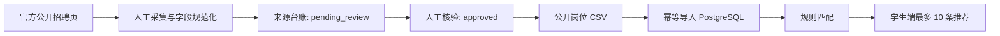

# 公开岗位数据扩展架构

## 数据流

## 数据边界

- 新增 `public-job-postings.csv`，字段保持与现有岗位导入兼容，并增加 `source_url`、`collected_on` 和 `review_status`。
- 每条记录使用稳定的来源 URL 和岗位编号生成幂等键；重复导入更新可公开字段，不创建重复岗位。
- 仅 `review_status=approved`、`status=published`、未过期且具备 `source_url` 的真实岗位参与匹配。
- `demo_only=false` 表示公开岗位信息，前端需保留来源标签与风险提示；`demo_only=true` 继续表示合成演示岗位。

## 接口与展示

- `POST /api/v1/matches` 的 `limit` 上限从 5 调整为 10；前端默认请求 10。
- 匹配响应继续返回来源标题、链接、发布日期、有效期与 `demo_only`，不返回内部采集备注或审核人信息。
- 管理员台账展示真实/模拟标识和来源状态；学生端只展示已发布记录。

## 验证

- 为公开岗位导入增加幂等、审核状态、过期过滤和来源链接测试。
- 以两类学生画像验证返回不超过 10 条，且每条真实岗位具备可点击来源。
- 导入前后运行隐私检查，确保不引入联系人、简历、投递记录或密钥。
